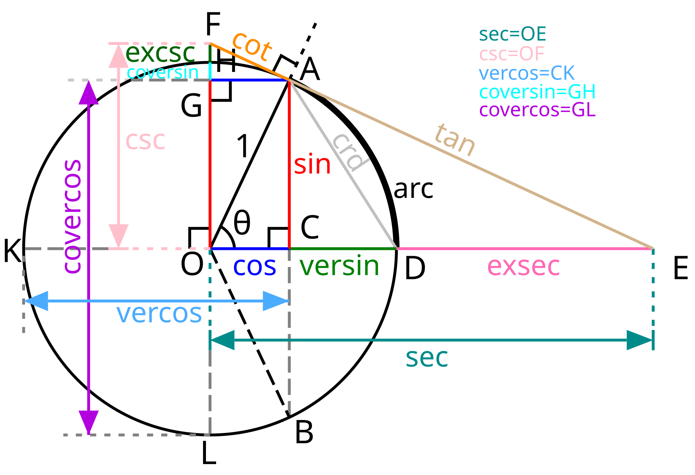

2D几何工具
=================

三角函数备忘图
-----------------



计算点到图形的切线
-----------------

### 点到圆的切线

圆外一点`P(x,y)`到圆的切线`PQ1`与`PQ2`

```javascript
Circle2D.getVertexesFrom(x: number, y: number): Array<Point2D>;
```


注意：

计算过程中都在用以圆心作为新坐标系的原点，
计算以圆心为顶点的角的角度；
如果用以点P作为新坐标系的原点，计算以P为顶点的角的角度来计算，
就要考虑到可考虑到圆在新的坐标系中不同象限时，
三角函数诱导公式的变化与符号的变化。会更加复杂

1. 计算线段`dx`与`dy`的长度分别为`C.x - P.x`与`C.y - P.y`。
	（注意：以圆心`C`为起点）
2. 计算线段`C->P`的长度`sqrt(dx^2 + dy^2)`。
3. 计算射线`C->P`的角度`alpha`等于`arctan(dy, dx)`。
4. `C->Q1`和`C->Q2`这两个射线与`C->P`的夹角`beta`
	分别为`arcos(CQ / CP)`，等于`arcos(r / CP)`。
5. 得到了`beta`这个`C->Q1`和`C->Q2`相对于`C->P`的夹角后，
	再加上`C->P`在坐标系中的角度`alpha`，
	就是`C->Q1`和`C->Q2`在整个坐标系中的角度：
	`beta1 = alpha + beta`和`beta2 = alpha - beta`
6. 通过`beta1`和`beta2`的角度与圆的半径，
	可以得到`Q1`和`Q2`相对于圆心的坐标。
	然后再加上圆心在坐标系中的坐标就可以到`Q1`和`Q2`在坐标系中的坐标:
	`Q1:(c.x + r * cos(beta1), c.y + r * sin(beta1))` ， 
	`Q2:(c.x + r * cos(beta2), c.y + r * sin(beta2))`

### 点到图形的切线

根据一个二维图形`shape`和外部的一点`P`，计算`P`与`shap`的两个切线的点`A`与`B`，再加上以`P`为起点的两条射线`P->A`与`P->B`：

```javascript
genVertexRaysFrom(
	x: number, y: number, shape: GeoShape2D, length?: number
): Array<{ vertex: Point2D, ray: Ray2D }>
```

### 计算点与线段的位置

```javascript
export function checkPointLineSide(
	line: ILine2D, p: IPoint2D
): number;
```

几种情况分别分析：

假设`A.y < B.y`的情况下，`(P.y < A.y) || (B.y < P.y)`：


### 计算旋转的角度

以点`C`为圆心，计算点`start`旋转到`end`的方向与角度：

* `c`：圆心，
* `start`：开始
* `end`：结束
* 返回：
	- `start`开始角度，
	- `end`结束角度，
	- `diff`旋转的角度

```javascript
export function revolveRay(
	c: IPoint2D, startPoint: IPoint2D, endPoint: IPoint2D
	): IRevolveOption;
```

